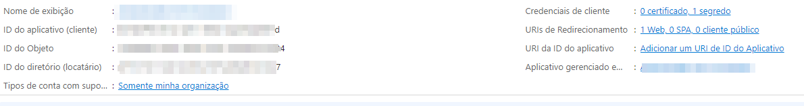
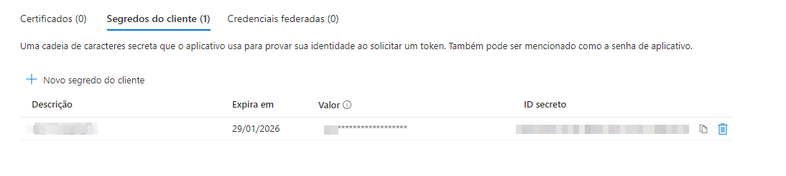
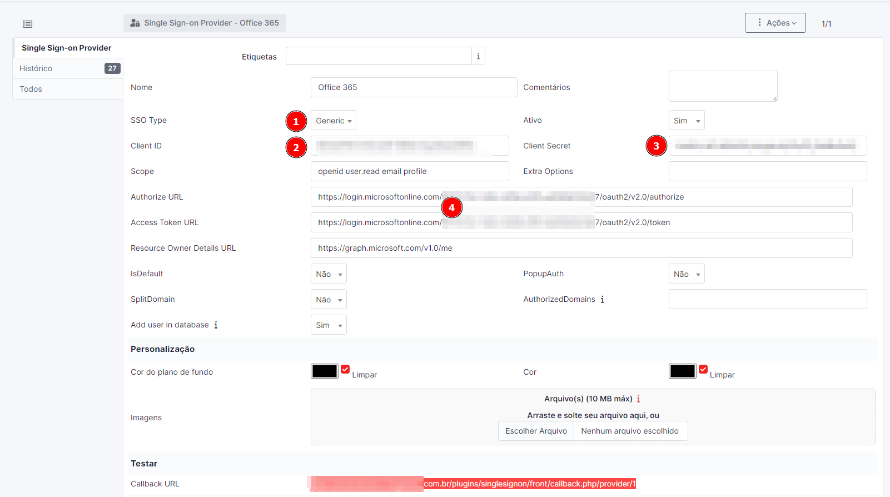

# Autenticação SINGLE SIGN-ON (SSO) Office 365 via Azure no GLPI 10

### Arquitetura de SSO do GLPI com o Office 365 (Azure)
 

## Requisitos:
#### Para integração do GLPI com o Office 365 no Azure, será necessario a instalação do plugin singlesignon no GLPI, configurar no Azure um registro de aplicativo e posteriomente configurar no GLPI com as informações de aplicativo que foi configurado anteriomente Azure.

   * [Plugin GitHub](https://github.com/mateusassis02/singlesignon.git) 
   * [É necessário que o GLPI possua certificado SSL ativado e válido (HTTPS).](https://nets-nuts.com.br/glpi-utilizando-a-porta-443/) 
   * [Portal Azure](https://portal.azure.com/)
  
   
## Primeiro Passo

#### Baixar o plugin no reposítório acima atraves do git clone.
         
         git clone https://github.com/mateusassis02/singlesignon.git

#### descompactar o arquivo na pasta “plugins” no diretório do seu GLPI.
          unzip singlesignon.zip na pasta padrão de plugins do GLPI e após isso instale o plugin na aba plugins do GLPI.

#### Registro de aplicativo no Azure

1 — https://portal.azure.com/

2 — procurar por “registro de aplicativo”

3 — Criar um novo registro

3.1 — Tipos de conta com suporte: Selecione a opção “Contas somente neste diretório organizacional (somente NOME DA EMPRESA – Único locatário)”.

3.2 — URIs de redirecionamento: Selecione “Web” e preencha com o link do campo “Url de callback” (exemplo https://atendimento.minhaempresa.com.br/plugins/singlesignon/front/callback.php/provider/1)

4 — Clique em “registrar”

Após registrado, teremos as seguintes informações:

ID do aplicativo ( cliente ), copie e cole no campo “2 (Client ID)” 
imagem no topico de configuração do plugin

ID do diretório (locatário) copie e cole no campo "4" copie e preencha as URL’s abaixo:
imagem no topico de configuração do plugin

https://login.microsoftonline.com/ID_LOCATARIO/oauth2/v2.0/authorize
https://login.microsoftonline.com/ID_LOCATARIO/oauth2/v2.0/token

   

#### Adicionaremos um segredo ao aplicativo criado, em “Credenciais do cliente”

1 — Clique em “Adicionar um certificado ou segredo”

2 — Clique em “Novo segredo do cliente”

3 — Adicione uma descrição e o prazo de expiração

4 — Será fornecido o campo “Valor”, copie e cole no campo “3 (Client Secret)”
imagem no topico de configuração do plugin

#### Configurando o Plugin no GLPI:

1 — Clique em “configurar” no plugin e adicione um novo item

2 — Preencher os valores:

1 — SSO Type: GENERIC

Resource Owner Details URL: https://graph.microsoft.com/v1.0/me

scope: openid user.read email profile

deixar marcado também a opção "Add user in database" para adicionar o usuário no banco de dados ou caso o usuario já exista com o mesmo e-mail do office 365, será linkado. 

#### Após salvar o item. Faça o logoff do GLPI e tente realizar o login via azure. Irá aparecer uma tela semelhante a essa:

## Com isso, sua integração estará funcional.

##### O desenvolvimento deste projeto foi fundamentado na referência do projeto do Matheus Rafael, segue o [link](https://medium.com/@matherafa/autentica%C3%A7%C3%A3o-sso-office-365-via-azure-no-glpi-10-2893d0f954d) 